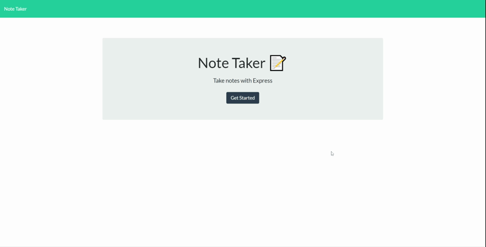

# Note Taker     

This application allows the user to create, save and delete notes.
Note taker was created using HTML/CSS, JavaScript, jQuery, Node.js, Express npm, inquirer npm, and path npm
### Demo

    
## Table of Contents
    
1. [Installation](#installation)
2. [Usage](#usage)
3. [Contributing](#contributing)
4. [Test](#test)
5. [Questions](#questions)
6. [License](#license)
    
# Installation
No installation needed. This application is live on heroku and can be used by simply clicking the link below:
- [Note Take](https://nameless-mountain-35631.herokuapp.com/)
# Usage
 - Once on the home page Click get started 
 - Type whatever note you'd like to save 
 - Click save icon on top right corner to store this note 
 - All saved notes will be displayed on the left hand side 
 - Click any previous note to view it 
 - Click red trash can icon to delete note
# Contributing
No guidelines for contribution. Feel free to expand or refactor application as you please. 
If you deside to expand on this application, please be aware that Node.js is required to be installed for local use. Simply type npm i in terminal to install all node dependencies.

# Questions
If you have any questions or would like to contact me feel free to reach me at:
- Email: santiago.sjs@gmail.com
- Github: [santu14](https://github.com/santu14)

## License

                Copyright 2020  Santiago Solana

    Permission to use, copy, modify, and/or distribute this software for any purpose with or without fee is hereby granted, provided that the above copyright notice and this permission notice appear in all copies.
